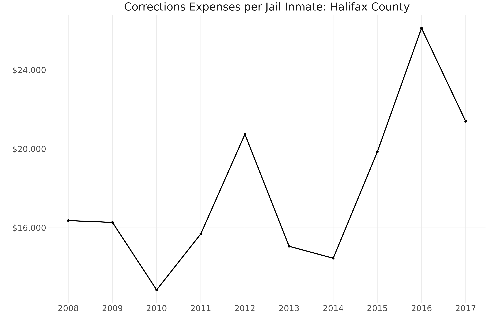

```{css, echo = FALSE}
h1, #TOC ul>li {
  color: #000000;
  background-color: #ffffff;
}
```

------------------------------------------------------------------------

The United States incarcerates more people per capita than anywhere else in the world,^1^ and a disproportionate number of those incarcerated are Black and Hispanic.^2^ Estimates from the ACLU suggest that one out of every three Black males and one out of every six Latino males will be incarcerated, compared to only one out of seventeen White males.

In addition to the human costs incurred by these mass incarceration policies, the current incarceration rate is extremely costly for taxpayers. The U.S. spends roughly \$60 to \$80 billion per year on state and federal prisons.^3,4^ But despite these expenditures, roughly two-thirds of individuals released from prison are re-arrested within three years.^5^

Halifax County, Virginia, is not immune to these national trends. At more than \$2.6 million, the corrections line item constituted nearly 3% of Halifax County's overall budget in 2017, translating to roughly \$21,000 per jail inmate and \$78 per Halifax County resident. These figures are largely consistent with Virginia's statewide costs, which total roughly \$21,299 per inmate and \$98 per state resident (though bear in mind these figures are calculated using prison populations rather than jail populations).^6^



Importantly, these values do not incorporate other operational expenses and indirect costs related to incarceration, including court proceedings, costs related to foster care, and costs for substance abuse treatment (among many others).

Halifax County has partnered with DSPG 2020 to investigate the factors associated with its incarceration and recidivism rate in the hopes of investing in proactive services through the Virginia Cooperative Extension Service, like a Family and Consumer Science Agent. Among other things, this position would help connect formerly incarcerated individuals to the community resources needed to help them effectively re-enter society. Even if such an agent were able to prevent relatively few encounters with the criminal justice system, the high costs mentioned above indicate that these efforts may quickly pay for themselves.

## Project Goals

Our primary goals for the summer have been to synthesize a variety of research to identify key social determinants of incarceration and recidivism as well as to identify accessible data sources that would allow us to characterize the state of these determinants in Halifax County. We hope that identifying emerging patterns in these determinants will allow Halifax to more specifically target those factors that are most relevant to the state of incarceration and recidivism in the county.

## Our Approach

We are using the social-ecological model^7^ to understand the factors related to incarceration in Halifax County. This model allows us to examine how factors at the individual, neighborhood and community, and policy levels shape behavior. It considers behavior as a result of inputs from a series of nested sociological levels:


With this framework as context, we sought to identify the levels at which various social determinants may influence patterns of incarceration and recidivism. Single factors may enter at numerous levels, emphasizing the nuances involved in exploring these issues.

For instance, access to housing for formerly incarcerated individuals is a complex result of policies that render them ineligible for certain housing opportunities, community attitudes surrounding willingness to live in areas near affordable housing projects, and family relationships that may provide a temporary housing option post-release.

Under this framework, our approach centered around an extensive literature review of research in the area, a comprehensive exploration and accumulation of available data sources on key factors impacting arrest and incarceration, and data visualizations to communicate the state of these factors in Halifax County, VA.

While we cannot make definitive conclusions on how these factors influence arrests and incarceration based on our visualizations, this project provides a foundation for Halifax County to build upon as it attempts to improve the state of incarceration within its borders. We connect the county with existing relevant data sources and identify the data required for a more comprehensive view of the issue to emerge.

------------------------------------------------------------------------

1.  Sentencing Project: Sentencing Project (n.d.) Criminal justice facts. Retrieved from: <https://www.sentencingproject.org/criminal-justice-facts/>↩
2.  APA: American Psychological Association [APA]. (2014). Incarceration nation. Monitor, 45(9), p. 56. Retrieved from: <https://www.apa.org/monitor/2014/10/incarceration>↩
3.  See footnote 2.↩
4.  American Civil Liberties Union [ACLU] (n.d.). Mass incarceration. Retrieved from: <https://www.aclu.org/issues/smart-justice/mass-incarceration>↩
5.  Durose, M.R., Cooper, A.D. & Snyder, H.N. (2014). Recidivism of prisoners released in 30 states in 2005: Patterns from 2005 to 2010 -- Update. Bureau of Justice Statistics [BJS]. Retrieved from: <https://www.bjs.gov/index.cfm?ty=pbdetail&iid=4986>↩
6.  Mai, C., & Subramanian, R. (2017). The Price of Prisons. Vera Institute of Justice.↩
7.  Centers for Disease Control [CDC]. (n.d.). The Social-ecological model: A framework for prevention. <https://www.cdc.gov/violenceprevention/publichealthissue/social-ecologicalmodel.html>↩
