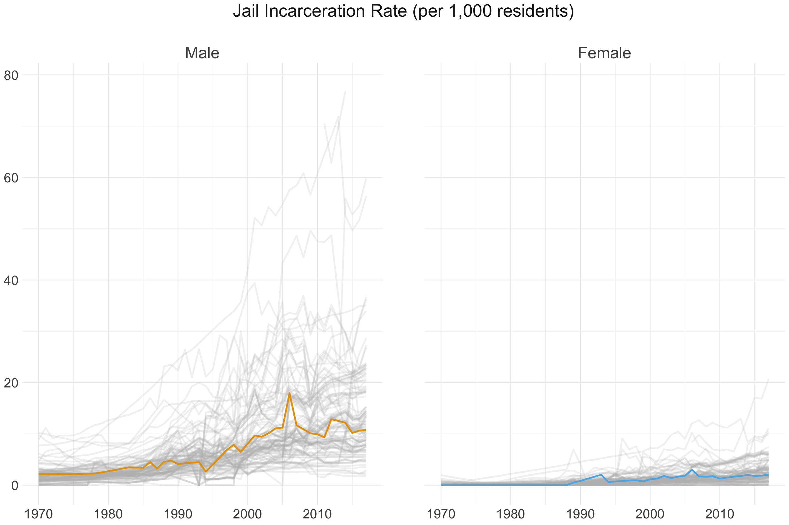
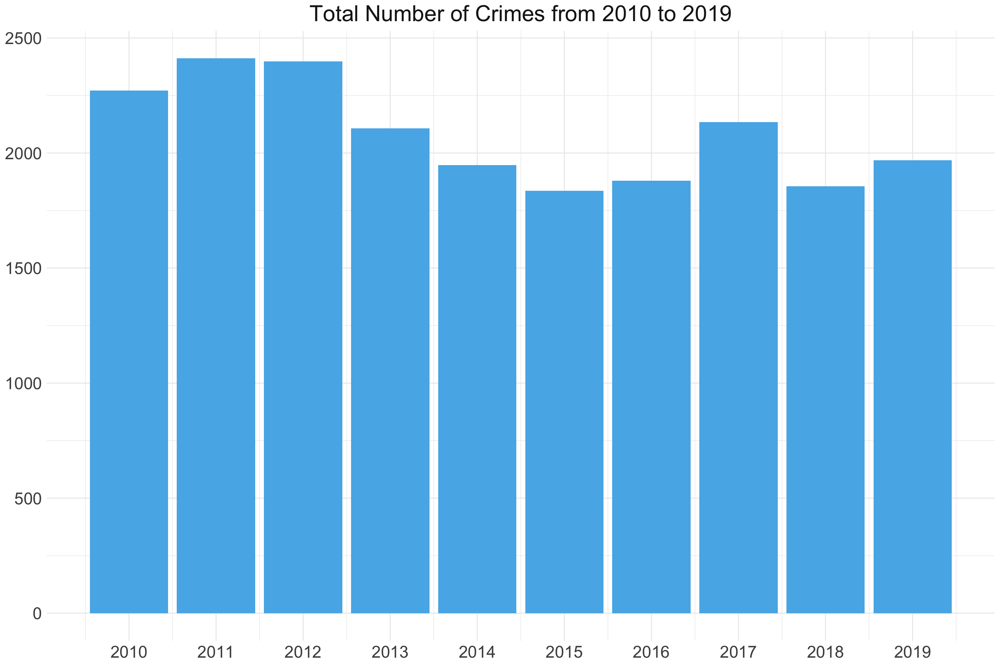
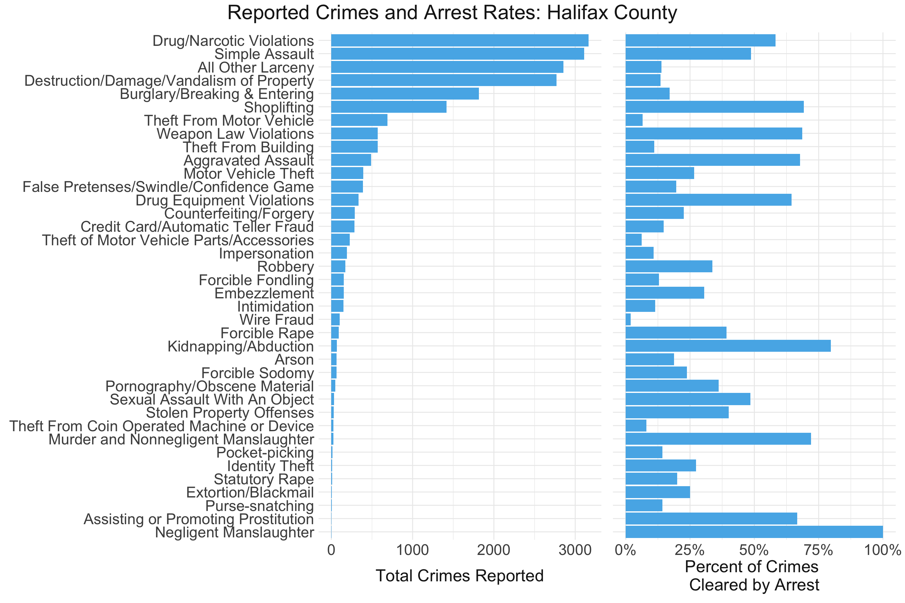

```{css, echo = FALSE}
h1, #TOC ul>li {
  color: #000000;
  background-color: #ffffff;
}
```

------------------------------------------------------------------------

## **Patterns in criminal justice indicators**

### **Background**

Incarceration, crime, and arrest are related but distinct concepts.
Crimes occur when individuals break the law, but not all crimes come to
the attention of law enforcement. Of the crimes that do come to the
attention of law enforcement, some are diverted from formal proceedings
and others result in arrest. Again, not all arrests result in
incarceration. Charges may be dismissed, an individual may post bail or
not be held pre-trial, or may be found not guilty at trial. Furthermore,
even after being convicted, a variety of punishments exist that do not
involve incarceration, including fines and community service.

Individuals who are incarcerated may be placed in a jail or prison.
Jails hold individuals who are awaiting trial or who have been sentenced
to less than year of incarceration. Prisons hold individuals who have
been convicted and sentenced to more than year of incarceration.
Although there are some differences across states, jails are generally
locally operated, and prisons are operated by state or federal
governments^[1](https://dspg-young-scholars-program.github.io/dspg20halifax/findings/crimes_page/?type=dspg#fn1?type=dspg)^.

Research has mostly focused on men incarcerated in prisons in urban
areas, but rural counties have seen a growth in the use of local
jails^[2](https://dspg-young-scholars-program.github.io/dspg20halifax/findings/crimes_page/?type=dspg#fn2?type=dspg)^,
particularly to incarcerate women. In fact, rural areas with populations
between 10,000 and 50,000, such as Halifax County, have the highest
rates of pre-trial
detention^[3](https://dspg-young-scholars-program.github.io/dspg20halifax/findings/crimes_page/?type=dspg#fn3?type=dspg)^.

Given that crime, arrests, and incarceration represent different parts
of the criminal justice system, we provide an overview of each in
Halifax County. Specifically, we investigate trends in crime over time,
common offense types, crime rates by race, and the percent of crimes
cleared by arrest. Then, we investigate the incarceration rate with a
focus on male and female incarceration rates as well as jails and
prisons incarceration rate over time.

### **Incarceration**

The figures below display the prison and jail incarceration rates in
Virginia counties, with Halifax County denoted by the lines in color,
from 1983 to 2013 and 1970 to 2017, respectively. It is clear that
prison incarceration rates, particularly among males, have consistently
and dramatically increased over the past three to four decades.
Comparatively, jail incarceration rates are not quite as high; however,
they have drastically increased since the mid-1990's. Incarceration
rates for females are significantly lower than those for males but have
also increased noticeably since 1990.

\


\
\



\

### **Crime Trends Over Time**

On average, 2,081 crimes came to the attention of law enforcement within
the 10-year period between 2010 and 2019 in Halifax County. In contrast
to the increase in incarceration, we notice a slight drop in reported
crimes over the past few years. Including the Virginia court records
data would help us determine whether these opposite trends may be
explained by variations in sentencing tendencies or other court-related
factors.

\



\

### **Most Common Offense Types and Clearance Rates**

The following figure displays the types of crimes that came to the
attention of law enforcement in Halifax County and their corresponding
clearance by arrest rate on the right. Drug violations, simple assault,
larceny, and destruction of property made up the bulk of the crimes;
however, this did not necessarily correspond to higher arrest rates.
While drug violations and simple assaults resulted in arrests nearly 50%
of the time, larceny and destruction of property resulted in arrests
much less frequently. This disparity highlights the complex process that
proceeds a crime coming to the attention of law enforcement and precedes
an arrest - namely that there exist many latent factors, including
difficulty of "solving" the crime and effort put forth by law
enforcement, that impact whether an arrest is made.

\

\
\

\
